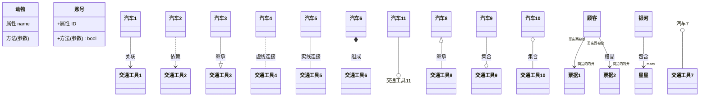

```mermaid
  classDiagram
  class 动物
  动物: 属性 name 
  动物: 方法(参数)

  class 账号{
    +属性 ID 
    +方法(参数) bool
  }

  汽车1 --> 交通工具1: 关联
  汽车2 ..> 交通工具2: 依赖
  汽车3 --|> 交通工具3: 继承
  汽车4 .. 交通工具4: 虚线连接
  汽车5 -- 交通工具5: 实线连接
  汽车6 *-- 交通工具6: 组成
  汽车7 ()-- 交通工具7
  汽车11 --() 交通工具11
  汽车8 <|-- 交通工具8 : 继承
  汽车9 --o 交通工具9: 集合
  汽车10 o-- 交通工具10: 集合
    
  顾客 "买东西被给予" --> "商品的的开票" 票据1
  顾客 "买东西被给予" --> "商品的的开票" 票据2 : 赠品
  银河 --> "many" 星星: 包含

  

```